# Component reference

<!-- Generated by scripts/import_reference.py from a BEMGen docs export; do not edit by hand. -->

Every component and parameter of the BEMGen tab in Grasshopper, generated from the plugin itself, so it matches the loaded version. Each entry gives the icon, nickname, GUID, and description, and for a component every input (type, access, whether it is optional, its default value) and output. Inputs with a default work when nothing is connected; a required input without a default must be connected. Plan generator entries show the viewport previews of their example definition.

| Panel | Components | Parameters |
| --- | --- | --- |
| [0 Info](info.md) | 1 | 7 |
| [1 Program](program.md) | 3 | 1 |
| [1 Program Presets](program-presets.md) | 19 | 0 |
| [2 Generate](generate.md) | 19 | 0 |
| [3 Simplify](simplify.md) | 4 | 0 |
| [4 Aggregate](aggregate.md) | 4 | 0 |
| [5 Convert](convert.md) | 2 | 0 |
| [6 Inspect](inspect.md) | 3 | 0 |

## All components and parameters

| | Name | Nickname | Panel |
| --- | --- | --- | --- |
|  | [Activity Hall Preset](program-presets.md#activity-hall-preset) | `Hall` | Program Presets |
|  | [Any Program Preset](program.md#any-program-preset) | `AnyP` | Program |
|  | [BEMGen Info](info.md#bemgen-info) | `Info` | Info |
|  | [Branching Mall](generate.md#branching-mall) | `BMall` | Generate |
|  | [Building](info.md#building) | `Bldg` | Info |
| 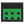 | [Cafeteria](generate.md#cafeteria) | `Cafe` | Generate |
|  | [Care Bedroom Preset](program-presets.md#care-bedroom-preset) | `CBed` | Program Presets |
|  | [Care Communal Preset](program-presets.md#care-communal-preset) | `CComm` | Program Presets |
| 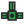 | [Care Hub](generate.md#care-hub) | `CHub` | Generate |
|  | [Clean Corridor Preset](program-presets.md#clean-corridor-preset) | `Clean` | Program Presets |
| 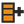 | [Clinical Support Preset](program-presets.md#clinical-support-preset) | `ClinS` | Program Presets |
|  | [Convert2BEM](convert.md#convert2bem) | `2BEM` | Convert |
|  | [Convert2IDF](convert.md#convert2idf) | `2IDF` | Convert |
|  | [Core Preset](program-presets.md#core-preset) | `Core` | Program Presets |
|  | [Corridor Preset](program-presets.md#corridor-preset) | `Corr` | Program Presets |
| 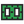 | [Court Cluster](generate.md#court-cluster) | `CCluster` | Generate |
|  | [Dining Preset](program-presets.md#dining-preset) | `Dine` | Program Presets |
|  | [Dirty Corridor Preset](program-presets.md#dirty-corridor-preset) | `Dirty` | Program Presets |
|  | [Dwelling Unit Preset](program-presets.md#dwelling-unit-preset) | `Unit` | Program Presets |
| 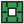 | [Enclosed Court](generate.md#enclosed-court) | `ECourt` | Generate |
|  | [Envelope Preset](program-presets.md#envelope-preset) | `Env` | Program Presets |
|  | [Envelope Preset](info.md#envelope-preset) | `Env` | Info |
|  | [Floor](info.md#floor) | `Floor` | Info |
| 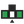 | [Foyer Halls](generate.md#foyer-halls) | `FHalls` | Generate |
| 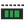 | [Gallery Bar](generate.md#gallery-bar) | `GBar` | Generate |
|  | [Inspect](inspect.md#inspect) | `Inspect` | Inspect |
|  | [Kitchen Preset](program-presets.md#kitchen-preset) | `Kitch` | Program Presets |
| 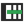 | [Linear Plan Generator](generate.md#linear-plan-generator) | `Linear` | Generate |
|  | [Load](info.md#load) | `L` | Info |
|  | [Load](program.md#load) | `Load` | Program |
|  | [Lobby Preset](program-presets.md#lobby-preset) | `Lobby` | Program Presets |
|  | [Mall Preset](program-presets.md#mall-preset) | `Mall` | Program Presets |
| 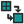 | [Map Source to Target](inspect.md#map-source-to-target) | `Map` | Inspect |
|  | [No Simplification](simplify.md#no-simplification) | `Z0` | Simplify |
|  | [Office Plate](generate.md#office-plate) | `OPlate` | Generate |
|  | [Office Preset](program-presets.md#office-preset) | `Office` | Program Presets |
| 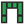 | [Open Court](generate.md#open-court) | `OCourt` | Generate |
| 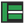 | [Operating Suite](generate.md#operating-suite) | `OSuite` | Generate |
|  | [Operating Theatre Preset](program-presets.md#operating-theatre-preset) | `OT` | Program Presets |
|  | [Perimeter Core](simplify.md#perimeter-core) | `Z2` | Simplify |
|  | [Plan](info.md#plan) | `Plan` | Info |
|  | [Point Plate](generate.md#point-plate) | `PPlate` | Generate |
|  | [Program Preset](info.md#program-preset) | `P` | Info |
|  | [Program Preset](program.md#program-preset) | `Preset` | Program |
|  | [Radial Lobes](generate.md#radial-lobes) | `RLobes` | Generate |
|  | [Retail Preset](program-presets.md#retail-preset) | `Retail` | Program Presets |
|  | [Schedule](program.md#schedule) | `Sch` | Program |
|  | [Schedule](info.md#schedule) | `Sch` | Info |
| 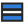 | [Semantic Merge](simplify.md#semantic-merge) | `Z1` | Simplify |
|  | [Service Preset](program-presets.md#service-preset) | `Serv` | Program Presets |
|  | [Single Zone Building](aggregate.md#single-zone-building) | `1ZBldg` | Aggregate |
|  | [Single Zone per Floor](simplify.md#single-zone-per-floor) | `Z3` | Simplify |
|  | [Single Zone per Floor Type](aggregate.md#single-zone-per-floor-type) | `1ZType` | Aggregate |
| 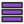 | [Stack Floors](aggregate.md#stack-floors) | `Stack` | Aggregate |
|  | [Stacked Floor Zone Multiplier](aggregate.md#stacked-floor-zone-multiplier) | `ZMult` | Aggregate |
| 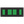 | [Stair Bay Bar](generate.md#stair-bay-bar) | `SBar` | Generate |
|  | [Stair Pair](generate.md#stair-pair) | `SPair` | Generate |
|  | [Stair Preset](program-presets.md#stair-preset) | `Stair` | Program Presets |
|  | [Stepped Band](generate.md#stepped-band) | `SBand` | Generate |
|  | [Terrace Row](generate.md#terrace-row) | `Terr` | Generate |
|  | [Transform Plan](generate.md#transform-plan) | `TPlan` | Generate |
|  | [Validate](inspect.md#validate) | `Validate` | Inspect |
|  | [Winged Band](generate.md#winged-band) | `WBand` | Generate |

## Example definitions

The definitions in the examples zip of each release, checked in Rhino before the release:

- `branching-mall.gh` ([canvas](../../assets/screenshots/canvas/branching-mall.png))
- `cafeteria.gh` ([canvas](../../assets/screenshots/canvas/cafeteria.png))
- `care-hub.gh` ([canvas](../../assets/screenshots/canvas/care-hub.png))
- `court-cluster.gh` ([canvas](../../assets/screenshots/canvas/court-cluster.png))
- `enclosed-court.gh` ([canvas](../../assets/screenshots/canvas/enclosed-court.png))
- `end-to-end.gh` ([canvas](../../assets/screenshots/canvas/end-to-end.png))
- `foyer-halls.gh` ([canvas](../../assets/screenshots/canvas/foyer-halls.png))
- `gallery-bar.gh` ([canvas](../../assets/screenshots/canvas/gallery-bar.png))
- `linear-plan.gh` ([canvas](../../assets/screenshots/canvas/linear-plan.png))
- `office-plate.gh` ([canvas](../../assets/screenshots/canvas/office-plate.png))
- `open-court.gh` ([canvas](../../assets/screenshots/canvas/open-court.png))
- `operating-suite.gh` ([canvas](../../assets/screenshots/canvas/operating-suite.png))
- `point-plate.gh` ([canvas](../../assets/screenshots/canvas/point-plate.png))
- `radial-lobes.gh` ([canvas](../../assets/screenshots/canvas/radial-lobes.png))
- `stair-bay-bar.gh` ([canvas](../../assets/screenshots/canvas/stair-bay-bar.png))
- `stair-pair.gh` ([canvas](../../assets/screenshots/canvas/stair-pair.png))
- `stepped-band.gh` ([canvas](../../assets/screenshots/canvas/stepped-band.png))
- `terrace-row.gh` ([canvas](../../assets/screenshots/canvas/terrace-row.png))
- `winged-band.gh` ([canvas](../../assets/screenshots/canvas/winged-band.png))
