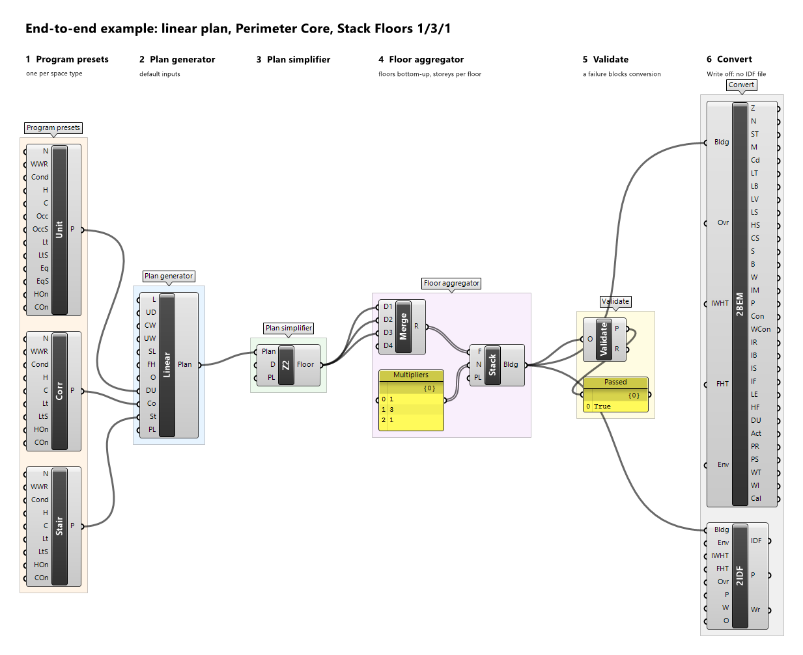
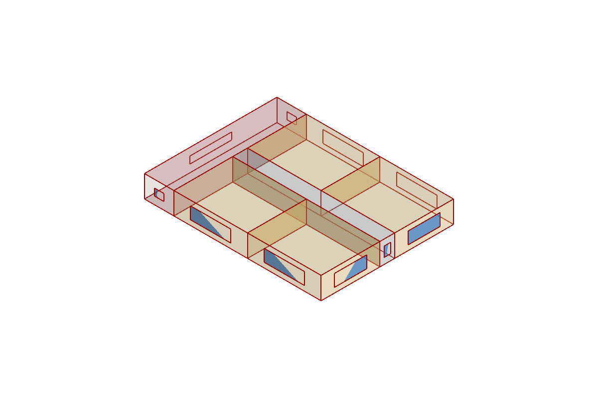
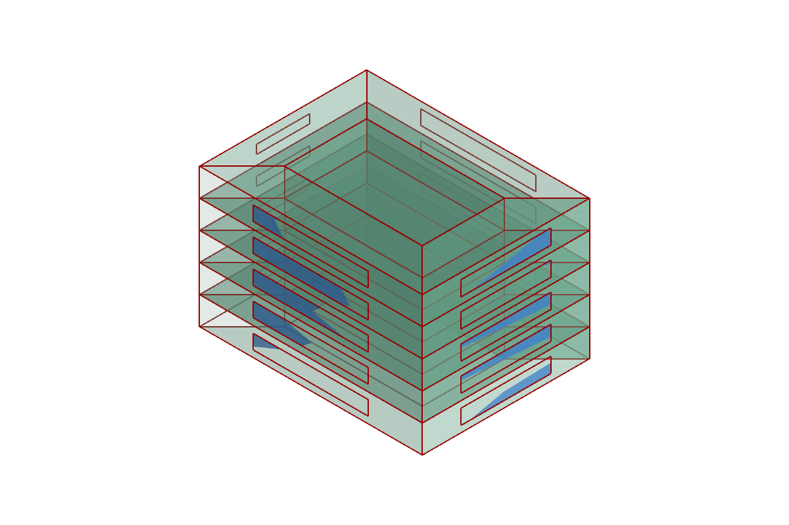

# End-to-end example

This example builds a five-storey residential bar from the default linear plan, simplifies every storey to perimeter and core zones, stacks the storeys, validates the building, and converts it with *Convert2BEM* and *Convert2IDF*. Every input value is given, and every expected result below was computed by BEMGen's own code with these inputs, so your definition should show exactly these numbers. The saved definition is `end-to-end.gh` in the repository's `examples/` folder.

## The definition

```text
Dwelling Unit Preset ─┐
Corridor Preset ──────┼─► Linear Plan Generator ─► Perimeter Core ─► Merge (×3) ─► Stack Floors ─┬─► Validate
Stair Preset ─────────┘                                               Panel 1,3,1 ─┘   (Multipliers) ├─► Convert2BEM
                                                                                                    └─► Convert2IDF
```



*The saved definition `end-to-end.gh`: presets, generator, Perimeter Core, Merge and the multipliers panel, Stack Floors, Validate, and the two converters, each step in its own group.*

### 1. Presets

Place *Dwelling Unit Preset* (Unit), *Corridor Preset* (Corr), and *Stair Preset* (Stair) from *1 Program Presets* and leave every input at its default:

| Preset | WWR | Conditioned | Heating / Cooling | Loads |
| --- | --- | --- | --- | --- |
| Example Dwelling Unit | 0.3 | yes | 21 °C / 24 °C | Occupancy 0.03 people/m², Lighting 5 W/m², Equipment 5 W/m², Infiltration 0.3 1/h |
| Example Corridor | 0.2 | yes | 21 °C / 24 °C | Lighting 5 W/m², Infiltration 0.3 1/h |
| Example Stair | 0.1 | no | — | Lighting 3 W/m², Infiltration 0.3 1/h |

### 2. Linear Plan Generator

Place *Linear Plan Generator* (Linear) from *2 Generate*, wire the three *Preset* outputs into *Dwelling Unit* (DU), *Corridor* (Co), and *Stair* (St), and keep the defaults:

| Input | Nickname | Value |
| --- | --- | --- |
| Length | L | 24 m |
| Unit Depth | UD | 8 m |
| Corridor Width | CW | 2 m |
| Unit Width | UW | 10 m |
| Stair Length | SL | 4 m |
| Floor Height | FH | 3 m |
| Orientation | O | 0° |
| Preview Location | PL | 0, 0, 0 |

Expected *Plan*: `Plan (6 zones, LinearPlanGenerator)`, 24 m × 18 m, 432 m².

| Zone | Space type | Area |
| --- | --- | --- |
| `ST` | Stair (unconditioned) | 72 m² |
| `CO` | Corridor | 40 m² |
| `US1`, `US2` (south row) | DwellingUnit | 80 m² each |
| `UN1`, `UN2` (north row) | DwellingUnit | 80 m² each |

The plan has 10 windows with 59.4 m² of glazing: 19.2 m² facing north, 15.6 m² east, 19.2 m² south, and 5.4 m² west.



### 3. Perimeter Core

Place *Perimeter Core* (Z2) from *3 Simplify*, wire the *Plan* into its *Plan* input, and keep *Depth* (D) at **4.57 m**.

Expected *Floor*: `Floor (5 zones, PerimeterCore)`, every zone of space type `Mixed` and conditioned:

| Zone | Area | Source zones |
| --- | --- | --- |
| `P-North` | 88.7951 m² | ST, UN1, UN2 |
| `P-East` | 61.3751 m² | CO, US2, UN2 |
| `P-South` | 88.7951 m² | ST, US1, US2 |
| `P-West` | 61.3751 m² | ST, CO, US1, UN1 |
| `CORE` | 131.6596 m² | CO, US1, US2, UN1, UN2 |

The floor still has 432 m² and 59.4 m² of glazing, now as 4 windows, one centred on each façade (19.2 m² north, 15.6 m² east, 19.2 m² south, 5.4 m² west); the core has no outdoor wall and no window. *Validate* on this floor gives *Passed* `True`, with one note: `note ConditionedFloorArea: reference 360.000000, actual 432.000000`, because the unconditioned stair is now part of conditioned perimeter zones.

### 4. Stack Floors with multipliers 1, 3, 1

Grasshopper keeps one wire per source and input: wiring *Perimeter Core*'s *Floor* output into *Floors* three times leaves a single wire and a single floor. So the floor goes through Grasshopper's native *Merge* component (*Sets* tab): place *Merge*, wire *Perimeter Core*'s *Floor* output into its inputs *D1*, *D2*, and *D3* (*Merge* adds a new input each time its last one is connected, so a spare *D4* stays empty), and wire *Merge*'s *Result*, a list of the same floor three times (the ground storey, the middle storeys, the top storey, bottom-up), into *Stack Floors*' *Floors* (F). Place *Stack Floors* (Stack) from *4 Aggregate*. For *Multipliers* (N), place a *Panel* with the three lines

```text
1
3
1
```

and *Multiline Data* off, so that it outputs one item per line, and wire it into *Multipliers*. *Stack Floors* repeats each floor by its multiplier, so the building has 1 + 3 + 1 = 5 explicit storeys. This is how `end-to-end.gh` is wired.

Expected *Building*: `Building (25 zones, Stack)`:

| Quantity | Value |
| --- | --- |
| Zones | 25: `L0/P-North`, `L0/P-East`, `L0/P-South`, `L0/P-West`, `L0/CORE`, then the same for `L1` to `L4`; every zone multiplier 1 |
| Floor area / volume / height | 2160 m² / 6480 m³ / 15 m |
| Surfaces | 150: 100 walls (20 outdoor, 80 between zones) and 50 floors and ceilings (5 on the ground, 40 between storeys, 5 roofs) |
| Exterior wall area | 1260 m² |
| Windows | 20, with 297 m² of glazing: 96 m² north, 78 m² east, 96 m² south, 27 m² west |
| Provenance (first line) | `Stack Multipliers=1,3,1 […]` |

The numbers on this page were computed for three identical *Perimeter Core* floors with the multipliers 1, 3, 1, which is exactly the building of `end-to-end.gh`.



### 5. Validate

Place *Validate* from *6 Inspect* and wire the *Building* into *Object*. Expected: *Passed* `True`. The *Report* starts with `PASSED`, then the checks of the one distinct source floor against its plan (`Floor0.…`, with the conditioned-area note above) and of the building against the fully stacked reference (`Building.…`), for example:

```text
  ok   Building.FloorArea: reference 2160.000000, actual 2160.000000
  ok   Building.Glazing: reference 297.000000, actual 297.000000
  ok   Building.Installed.Lighting: reference 10080.000000, actual 10080.000000
  ok   Building.GroundArea: reference 432.000000, actual 432.000000
  ok   Building.RoofArea: reference 432.000000, actual 432.000000
  ok   Building.Height: reference 15.000000, actual 15.000000
```

### 6. Convert2BEM

Place *Convert2BEM* (2BEM) from *5 Convert* and wire the *Building*. Leave *Override*, *EnableInternalWallHeatTransfer*, and *EnableFloorHeatTransfer* at `False` and *Envelope* unconnected (the *Example Envelope* is used).

| Output | Expected |
| --- | --- |
| Zones, Names, Space Types, Multipliers, Conditioned | 25 branches `{0}` to `{24}`; names `L0/P-North` … `L4/CORE`; every space type `Mixed`, multiplier `1`, conditioned `True` |
| Load Types / Load Bases | 4 per zone: `Occupancy`, `Lighting`, `ElectricEquipment` (all `PerFloorArea`), `Infiltration` (`AirChangesPerHour`) |
| Load Values | e.g. `L0/P-North`: 0.027297, 4.81981, 4.549525, 0.3; `L0/CORE`: 0.023228, 5, 3.871332, 0.3 (rounded) |
| Load Schedules | 100 branches `{i;k}` of 8760 values |
| Heating / Cooling Setpoints | 8760 values per zone, 21 °C and 24 °C |
| Surfaces / Boundaries / Constructions | 6 per zone, 150 in all. Boundaries: 20 `Outdoors` walls, 80 `Adiabatic` walls, 5 `Ground` floors, 40 `Adiabatic` floors and ceilings, 5 `Outdoors` roofs. Constructions: `Example Exterior Wall`, `Example Interior Wall`, `Example Ground Floor`, `Example Interior Floor` (floors above a storey), `Example Interior Floor Reversed` (ceilings below one), `Example Roof` |
| Windows / Window Constructions | 20 windows, one per perimeter zone and storey; each `Example Double Glazing`; the `CORE` zones have no branch |
| Internal Mass | 0 for every zone |
| Provenance | the provenance tree, the validation report, `OPTIONS: EnableInternalWallHeatTransfer=False EnableFloorHeatTransfer=False`, `ENVELOPE: Example Envelope` |

Set both heat-transfer options to `True` and the 120 adiabatic surfaces become `Interzone:<zone ID>`, for example a wall of `L0/P-North` against the core is written `Interzone:L0/CORE`.

### 7. Convert2IDF with Write off

Place *Convert2IDF* (2IDF) from *5 Convert* and wire the *Building*. Leave *Envelope* unconnected, *EnableInternalWallHeatTransfer*, *EnableFloorHeatTransfer*, and *Override* `False`, *Path* empty, and **Write `False`** and *Overwrite* `False`.

| Output | Expected |
| --- | --- |
| IDF | the full IDF text; the component shows no runtime message |
| Written | `False` |
| Provenance | ends with `ENVELOPE: Example Envelope`, `ENERGYPLUS: 25.2`, and `FILE: not written (Write is false)` |

The IDF holds 25 `Zone` objects, 150 `BuildingSurface:Detailed`, 20 `FenestrationSurface:Detailed`, 25 each of `People`, `Lights`, `ElectricEquipment`, and `ZoneInfiltration:DesignFlowRate`, 25 thermostats with ideal-loads air systems, 8 materials, 1 simple glazing, 7 constructions (the six above and the window construction `Example Double Glazing`), and 4 monthly meters.

To write the file, give *Path* a fully qualified path in an existing folder, for example `C:\models\end-to-end.idf`, and set *Write* to `True`; *Written* becomes `True` and *Provenance* ends with `FILE: written C:\models\end-to-end.idf`. Before simulating, add a weather file and the outputs you need; BEMGen does not run EnergyPlus.

## Variations to try

- Replace *Perimeter Core* with *Single Zone per Floor*: each storey becomes one zone, and the building has 5 zones with the same 2160 m², 297 m² of glazing, and loads.
- Replace *Stack Floors* with *Stacked Floor Zone Multiplier*: the three middle storeys are modelled once, by storey `L2` at its true elevation with zone multiplier 3, so the building has 15 zones (provenance `Storeys=L0x1,L2x3,L4x1`); storeys `L1` and `L3` are drawn transparent grey, and the totals that *Validate* checks stay the same.
- Change *Orientation* to 90: the geometry stays, but every façade's orientation changes, so the glazing per orientation in the validation report changes accordingly.
