# Typologies

BEMGen has one plan generator for each family of its precedent set, eighteen in all, housing and non-residential, all in panel *2 Generate*. The families come from four books on housing and building planning; they fix only which parts a plan has and how they connect, so every dimension and count below is a design input with a default chosen for BEMGen. The family `SYN-TYP-013` (an incremental row with reserved expansion bays) has no generator. Family rules and sources: [four-source typology families](../developer/research/precedents/syn-typologies.md).

The images show each family's example definition in the viewport: the default plan (left) and the building after its simplifier and floor aggregator (right), as listed under [Example definitions](#example-definitions).

Every generator works as the [workflow](workflow.md#2-generate-a-plan) describes: dimensions in metres, a *Floor Height* (floor-to-floor) and an *Orientation* (degrees clockwise from true north, default 0), one required preset input per space type, *Preview Location* last, and one *Plan* output. Housing families zone one zone per dwelling (plus stairs and corridors); non-residential families zone one zone per department.

## Overview

The counts are those of the default plan with the default presets of the matching space types.

| Generator (nickname) | Family | Preset inputs | Zones | Floor area | Windows |
| --- | --- | --- | --- | --- | --- |
| *Linear Plan Generator* (Linear) | `SYN-TYP-009` double-sided internal corridor bar | Dwelling Unit, Corridor, Stair | 6 | 432 m² | 10 |
| *Stair Bay Bar* (SBar) | `SYN-TYP-001` repeated stair bays in a linear bar | Dwelling Unit, Stair | 9 | 612 m² | 20 |
| *Stair Pair* (SPair) | `SYN-TYP-008` one stair between a dwelling pair | Dwelling Unit, Stair | 3 | 204 m² | 8 |
| *Gallery Bar* (GBar) | `SYN-TYP-002` continuous external gallery beside a linear bar | Dwelling Unit, Stair | 8 | 440 m² | 18 |
| *Terrace Row* (Terr) | `SYN-TYP-006` attached narrow terrace row | Dwelling Unit | 6 | 330 m² | 14 |
| *Point Plate* (PPlate) | `SYN-TYP-007` compact point-access tower plate | Dwelling Unit, Stair | 5 | 484 m² | 8 |
| *Winged Band* (WBand) | `SYN-TYP-003` projecting wings joined by a common band | Dwelling Unit, Stair | 21 | 1452 m² | 43 |
| *Open Court* (OCourt) | `SYN-TYP-004` open U-shaped court with stair-served wings | Dwelling Unit, Stair | 15 | 984 m² | 30 |
| *Enclosed Court* (ECourt) | `SYN-TYP-005` enclosed courtyard residential block | Dwelling Unit, Stair | 24 | 1728 m² | 44 |
| *Court Cluster* (CCluster) | `SYN-TYP-011` linked housing clusters around several courts | Dwelling Unit, Stair | 39 | 2880 m² | 72 |
| *Radial Lobes* (RLobes) | `SYN-TYP-010` radial lobes around a point tower core | Dwelling Unit, Stair | 9 | 624 m² | 16 |
| *Stepped Band* (SBand) | `SYN-TYP-012` stepped dwelling bands with exposed terraces | Dwelling Unit, Corridor, Stair | 7 per storey | 576, 468, 360 m² | 11 per storey |
| *Office Plate* (OPlate) | `SYN-TYP-017` central service core within an office plate | Office, Core | 2 | 1260 m² | 4 |
| *Cafeteria* (Cafe) | `SYN-TYP-016` cafeteria service edge beside a dining field | Kitchen, Dining | 2 | 690 m² | 6 |
| *Branching Mall* (BMall) | `SYN-TYP-014` branching public mall between retail wings | Mall, Retail | 10 | 7744 m² | 16 |
| *Care Hub* (CHub) | `SYN-TYP-018` communal hub serving elder-care bedroom groups | Care Bedroom, Care Communal, Corridor | 10 | 1552 m² | 16 |
| *Foyer Halls* (FHalls) | `SYN-TYP-019` public foyer branching to distinct activity spaces | Lobby, Activity Hall, Service | 4 | 1800 m² | 10 |
| *Operating Suite* (OSuite) | `SYN-TYP-015` operating suite with separated clean and dirty routes | Operating Theatre, Clean Corridor, Dirty Corridor, Clinical Support | 6 | 1046.4 m² | 8 |

Wire each preset input from the built-in preset component of the same name in *1 Program Presets* (*Dwelling Unit Preset* into *Dwelling Unit*, and so on), from a general *Program Preset* of that space type, or from *Any Program Preset* to use another program ([workflow](workflow.md#any-program-preset)).

## Housing

### Linear Plan Generator

A bar with a full-depth stair at the west end (`ST`), a double-loaded corridor along the middle (`CO`), and a row of equal dwellings on each side (`US1`, `US2`, … south, `UN1`, `UN2`, … north). Inputs: *Length* (L) 24, *Unit Depth* (UD) 8, *Corridor Width* (CW) 2, *Unit Width* (UW) 10, the target dwelling width, the rows being divided evenly, *Stair Length* (SL) 4, *Floor Height* (FH) 3, *Orientation* (O) 0. Lineage: `HDHM-TYP-009`. The [end-to-end example](example-end-to-end.md) uses it.

{ width="49%" }
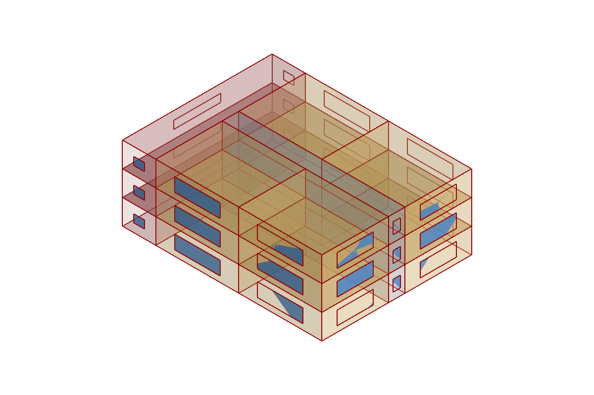{ width="49%" }

Example: `linear-plan.gh` ([canvas](../assets/screenshots/canvas/linear-plan.png)); reference: [Linear Plan Generator](components/generate.md#linear-plan-generator).

### Stair Bay Bar

Repeated bays of dwelling, stair, dwelling through the full depth, each stair serving the two dwellings beside it; no corridor. Zones `ST1…`, then `U1…`. Inputs: *Bay Count* (BC) 3 (at least 2), *Unit Width* (UW) 7, *Depth* (D) 12, *Stair Width* (SW) 3, *Floor Height* (FH) 3, *Orientation* (O) 0. Lineage: `HDHM-TYP-001`.

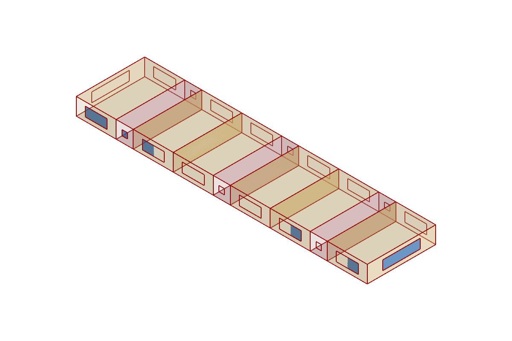{ width="49%" }
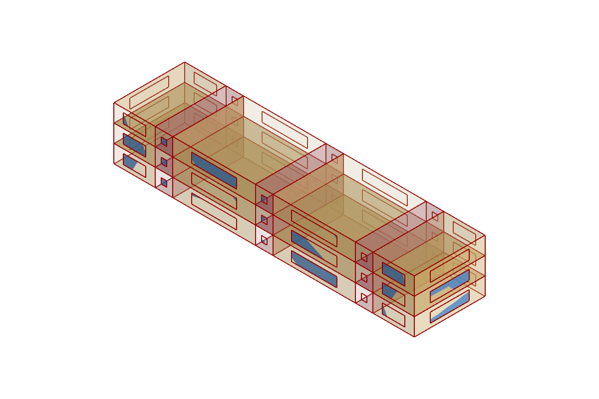{ width="49%" }

Example: `stair-bay-bar.gh` ([canvas](../assets/screenshots/canvas/stair-bay-bar.png)); reference: [Stair Bay Bar](components/generate.md#stair-bay-bar).

### Stair Pair

One stair bay of the *Stair Bay Bar* as its own building: two dwellings on either side of one stair (`ST1`, `U1`, `U2`). Inputs: *Unit Width* (UW) 7, *Depth* (D) 12, *Stair Width* (SW) 3, *Floor Height* (FH) 3, *Orientation* (O) 0. Lineage: `HDHM-TYP-008`.

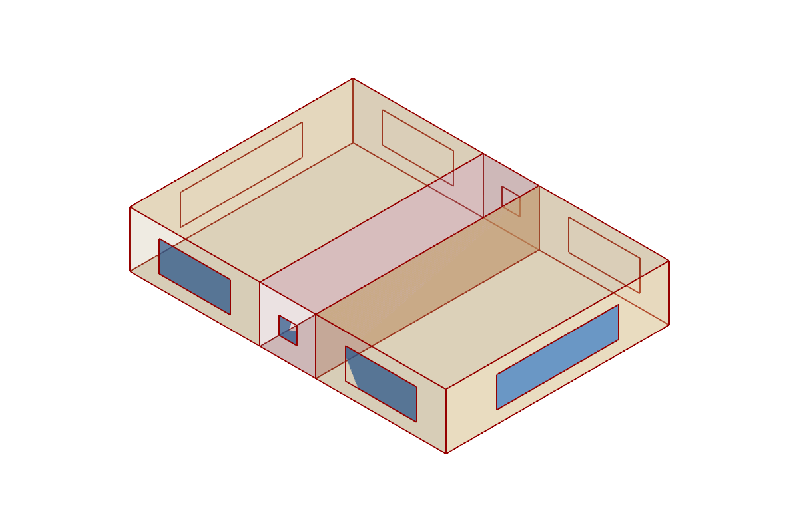{ width="49%" }
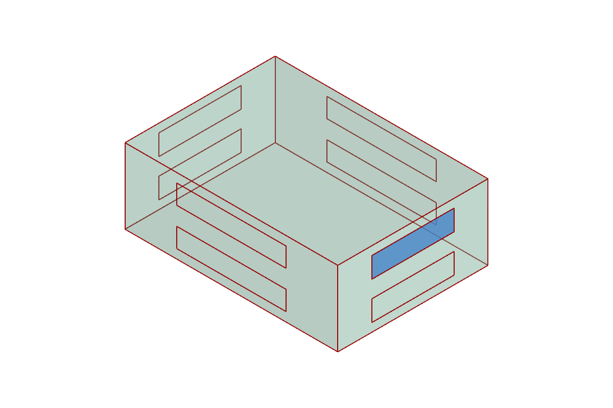{ width="49%" }

Example: `stair-pair.gh` ([canvas](../assets/screenshots/canvas/stair-pair.png)); reference: [Stair Pair](components/generate.md#stair-pair).

### Gallery Bar

A row of dwellings through the bar depth between a stair at each end (`ST1` west, `ST2` east, `U1…`). The external gallery itself is not modelled: there is no gallery zone, and the gallery side is an ordinary outdoor façade. Inputs: *Unit Count* (UC) 6 (at least 2), *Unit Width* (UW) 6, *Depth* (D) 10, *Stair Width* (SW) 4, *Floor Height* (FH) 3, *Orientation* (O) 0. Lineage: `HDHM-TYP-002`.

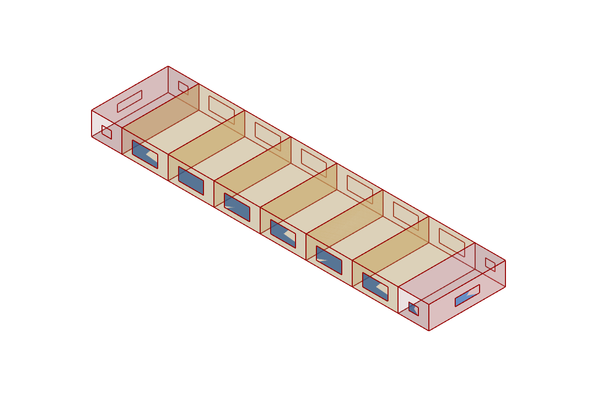{ width="49%" }
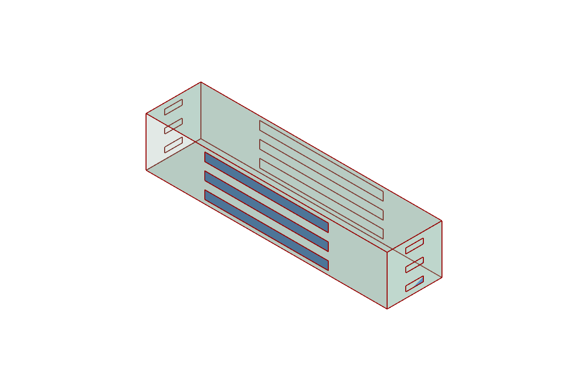{ width="49%" }

Example: `gallery-bar.gh` ([canvas](../assets/screenshots/canvas/gallery-bar.png)); reference: [Gallery Bar](components/generate.md#gallery-bar).

### Terrace Row

Attached house plots sharing dividing walls, one dwelling zone per plot and storey (`U1…`, named *House i*); each house's own stair is inside the dwelling and not zoned. Inputs: *Plot Count* (PC) 6 (at least 2), *Plot Width* (PW) 5.5, *Depth* (D) 10, *Floor Height* (FH) 3, *Orientation* (O) 0. Only a *Dwelling Unit* preset. Lineage: `HDHM-TYP-006`.

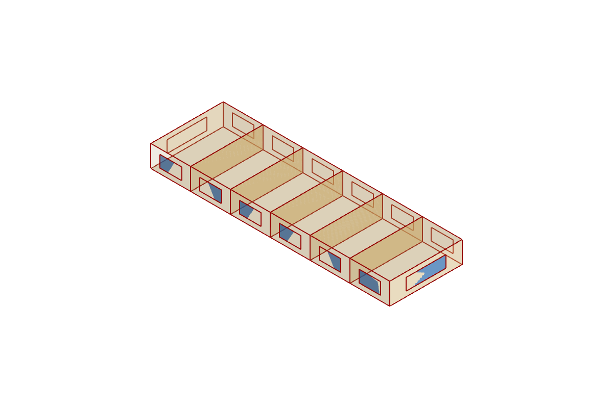{ width="49%" }
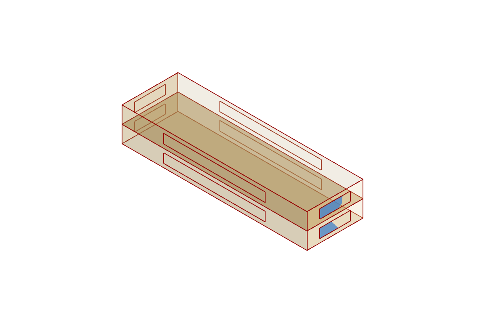{ width="49%" }

Example: `terrace-row.gh` ([canvas](../assets/screenshots/canvas/terrace-row.png)); reference: [Terrace Row](components/generate.md#terrace-row).

### Point Plate

A square plate of side *Core Width* + 2 × *Dwelling Depth* (22 m by default) with a central core `ST` (a Stair zone without outdoor walls) and four dwellings `U1…U4` in a pinwheel around it, each with two façades. Inputs: *Dwelling Depth* (DD) 8, *Core Width* (CW) 6, *Floor Height* (FH) 3, *Orientation* (O) 0. Lineage: `HDHM-TYP-007`.

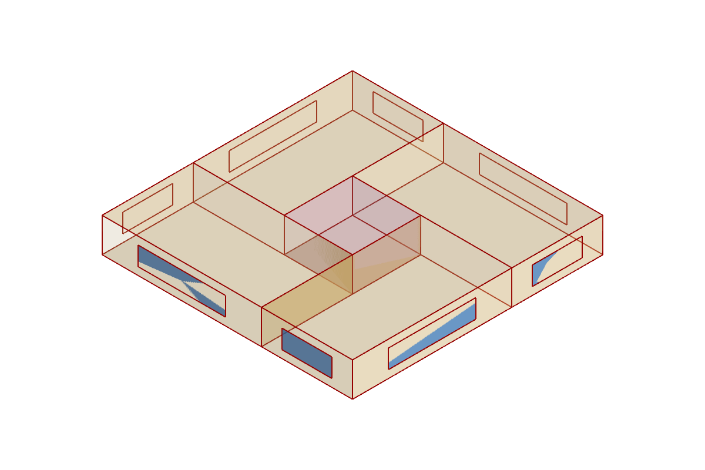{ width="49%" }
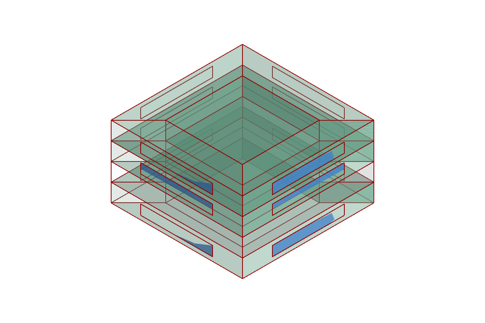{ width="49%" }

Example: `point-plate.gh` ([canvas](../assets/screenshots/canvas/point-plate.png)); reference: [Point Plate](components/generate.md#point-plate).

### Winged Band

A band of stair bays with wings of stair bays projecting to plan north, each joined to the band along its whole root, so the outline is a comb. Zones `B-ST1…`, `B-U1…` (band), then `W{i}-ST1…`, `W{i}-U1…` (wing *i*). The dwelling width is adjusted so that the bays fill the band and each wing exactly; a band façade fragment shorter than 1 m between wings gets no window. Inputs: *Wing Count* (WC) 3 (at least 2), *Wing Length* (WL) 17, *Wing Spacing* (WS) 17, *Depth* (D) 12, *Unit Width* (UW) 7, *Stair Width* (SW) 3, *Floor Height* (FH) 3, *Orientation* (O) 0. Lineage: `HDHM-TYP-003`.

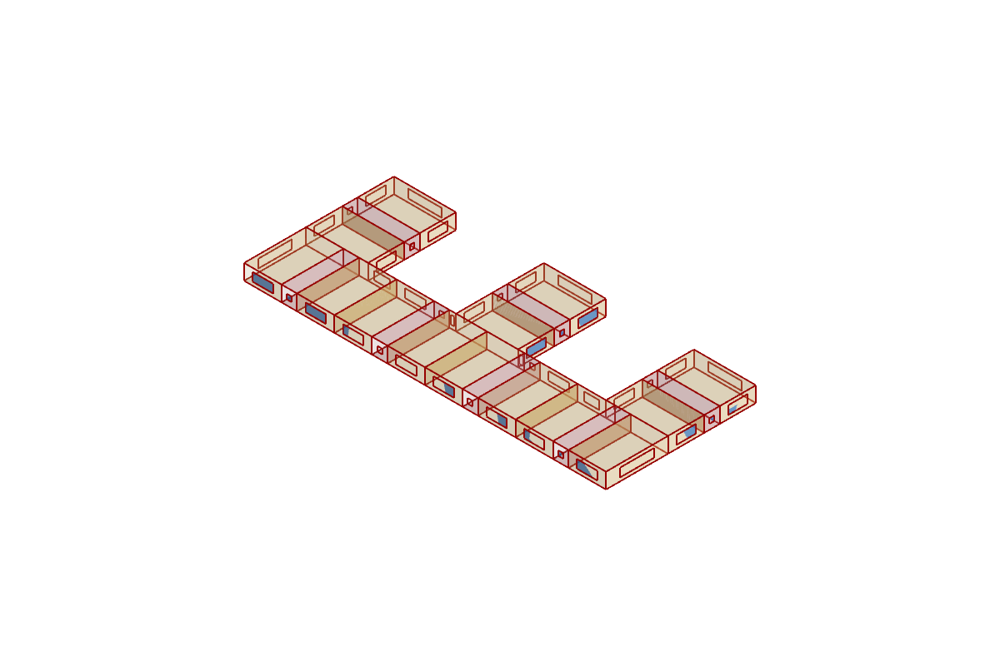{ width="49%" }
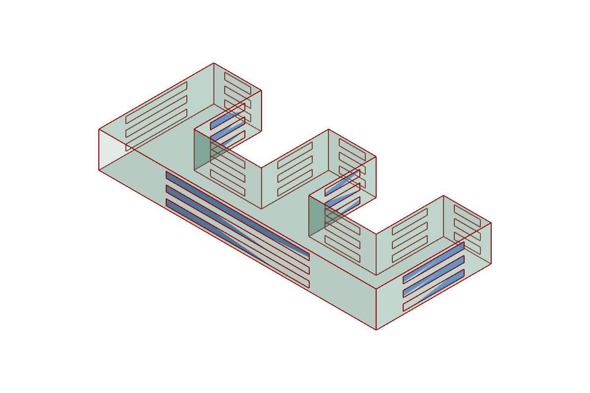{ width="49%" }

Example: `winged-band.gh` ([canvas](../assets/screenshots/canvas/winged-band.png)); reference: [Winged Band](components/generate.md#winged-band).

### Open Court

West, east, and north wings of stair bays around a court open to plan south; every dwelling adjoins a stair of its bay. Zones `N-…`, then `W-…` and `E-…`. Inputs: *Court Width* (CW) 24, *Court Depth* (CD) 17, *Depth* (D) 12, *Unit Width* (UW) 7, *Stair Width* (SW) 3, *Floor Height* (FH) 3, *Orientation* (O) 0. Lineage: `HDHM-TYP-004`.

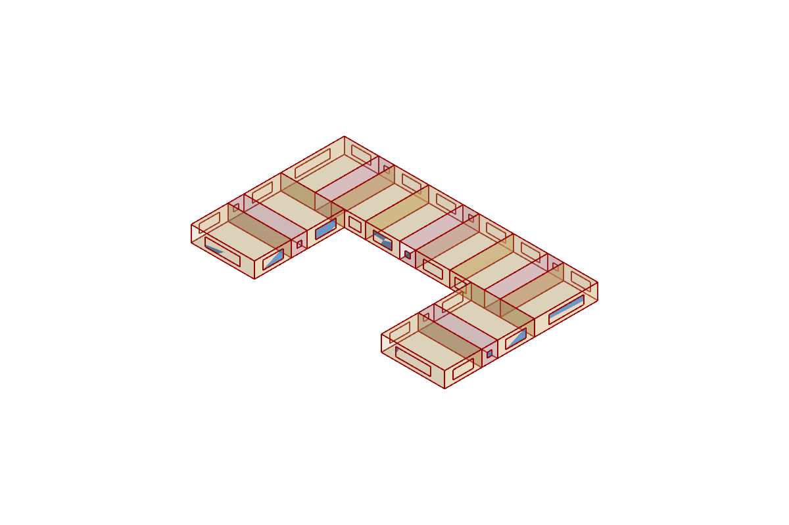{ width="49%" }
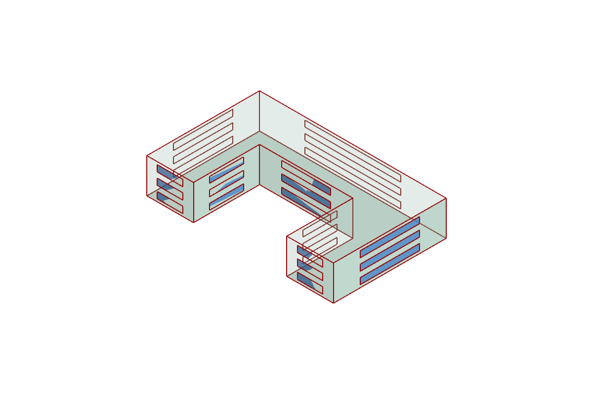{ width="49%" }

Example: `open-court.gh` ([canvas](../assets/screenshots/canvas/open-court.png)); reference: [Open Court](components/generate.md#open-court).

### Enclosed Court

Four wings of stair bays around a court closed on all four sides. The footprint has the court as a hole: the court is outside the building, and its façades are outdoor walls with windows facing into it (16 of the 44 windows by default). *Perimeter Core* zones the court façades separately (`P-Court-North`, …) around a ring-shaped core. Zones `S-…`, `N-…`, then `W-…`, `E-…`. Inputs: *Court Width* (CW) 24, *Court Depth* (CD) 24, *Depth* (D) 12, *Unit Width* (UW) 7, *Stair Width* (SW) 3, *Floor Height* (FH) 3, *Orientation* (O) 0. Lineage: `HDHM-TYP-005`.

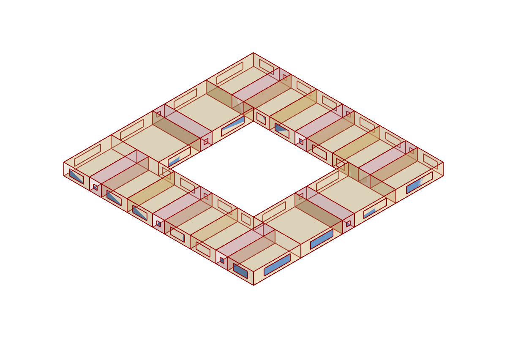{ width="49%" }
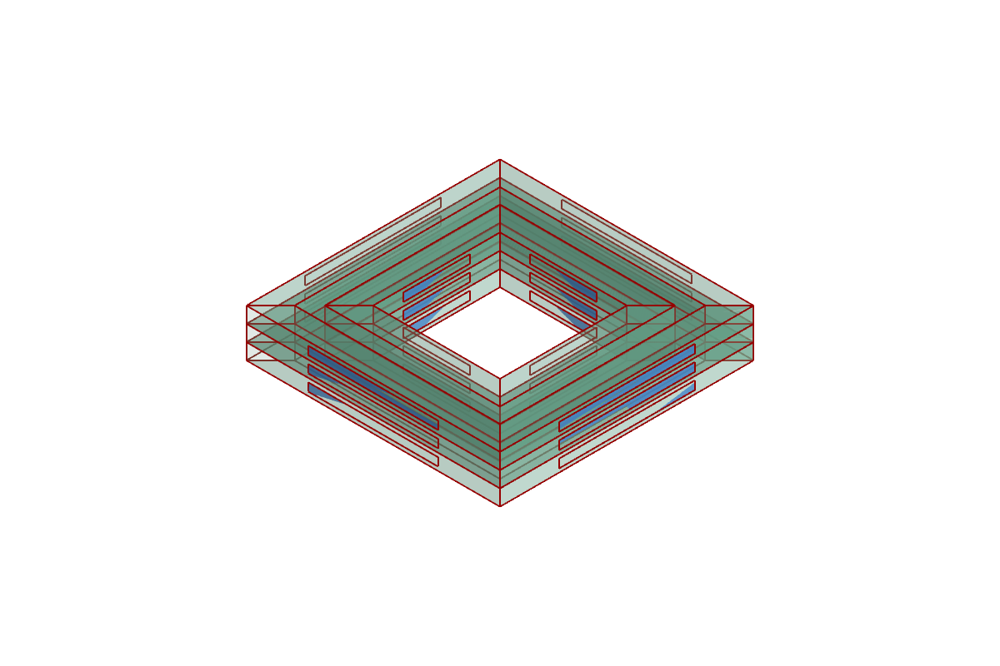{ width="49%" }

Example: `enclosed-court.gh` ([canvas](../assets/screenshots/canvas/enclosed-court.png)); reference: [Enclosed Court](components/generate.md#enclosed-court).

### Court Cluster

A row of courts closed by wings of stair bays: south and north wings across the full width, and a west, middle, and east wing between them, each middle wing bordering two courts. The footprint has one hole per court. Zones `S-…`, `N-…`, then `W-…`, `M1-…`, …, `E-…`. Inputs: *Court Count* (CC) 2 (at least 2), *Court Width* (CW) 24, *Court Depth* (CD) 24, *Depth* (D) 12, *Unit Width* (UW) 7, *Stair Width* (SW) 3, *Floor Height* (FH) 3, *Orientation* (O) 0.

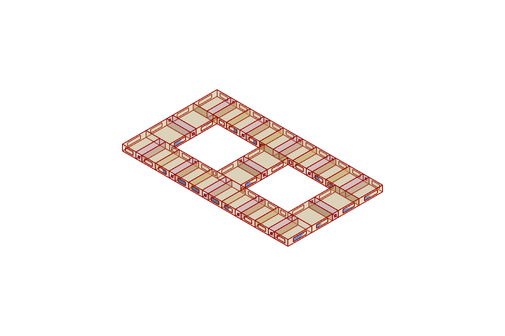{ width="49%" }
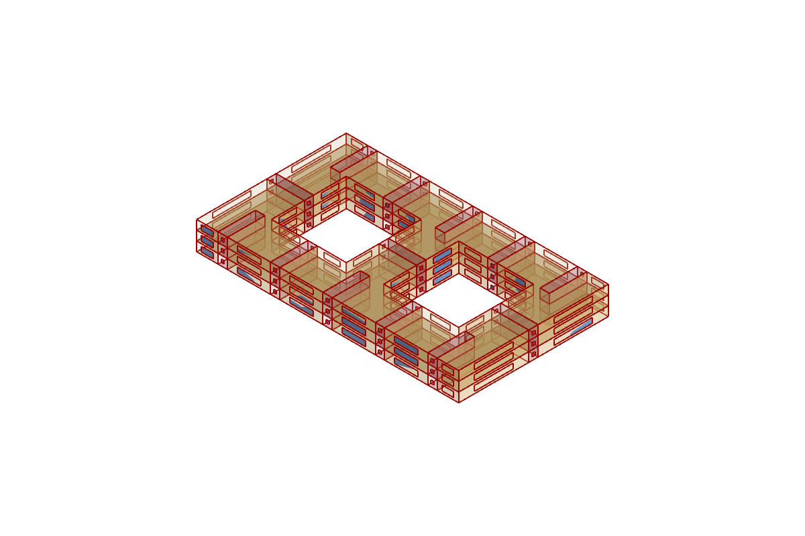{ width="49%" }

Example: `court-cluster.gh` ([canvas](../assets/screenshots/canvas/court-cluster.png)); reference: [Court Cluster](components/generate.md#court-cluster).

### Radial Lobes

Three or four lobes on the sides of a square core `ST`, east, north, west, then south, each lobe holding two dwellings side by side (`L{i}-U1`, `L{i}-U2`) that both adjoin the core; no other circulation. With three lobes the core's south side is a façade. Inputs: *Lobe Count* (LC) 4 (3 or 4), *Lobe Length* (LL) 10, *Lobe Width* (LW) 12 (at most *Core Width*), *Core Width* (CW) 12, *Floor Height* (FH) 3, *Orientation* (O) 0.

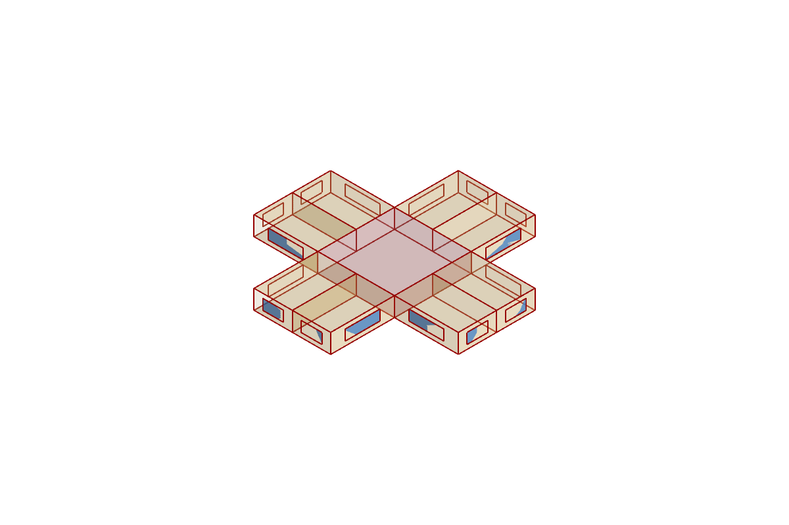{ width="49%" }
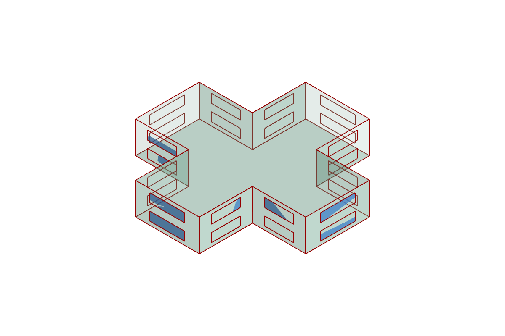{ width="49%" }

Example: `radial-lobes.gh` ([canvas](../assets/screenshots/canvas/radial-lobes.png)); reference: [Radial Lobes](components/generate.md#radial-lobes).

### Stepped Band

A band of dwellings between a west stair `ST` and a rear corridor `CO` that steps back storey by storey on the south side, so that each lower roof keeps a terrace. It is the only generator with one plan per storey: its *Plan* output is the list of storey plans, bottom to top. Simplify the list and give the floors to an aggregator with *Multipliers* unconnected ([storey plans](workflow.md#storey-plans)). Inputs: *Storey Count* (SC) 3 (at least 2), *Length* (L) 36, *Base Depth* (BD) 14 (the dwelling depth on the ground storey; it must exceed (*Storey Count* − 1) × *Step Depth*), *Step Depth* (SD) 3 (the terrace depth), *Corridor Width* (CW) 2, *Unit Width* (UW) 6, *Stair Width* (SW) 4, *Floor Height* (FH) 3, *Orientation* (O) 0. By default five dwellings of 6.4 m per storey, and storeys of 576, 468, and 360 m², drawn at 0, 3, and 6 m.

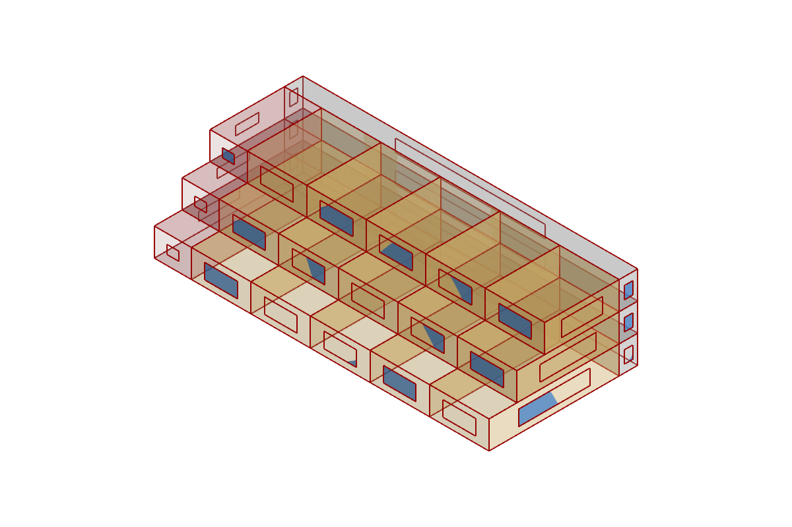{ width="49%" }
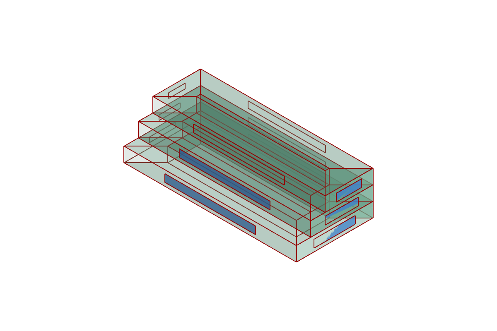{ width="49%" }

Example: `stepped-band.gh` ([canvas](../assets/screenshots/canvas/stepped-band.png)); reference: [Stepped Band](components/generate.md#stepped-band).

## Non-residential

### Office Plate

A rectangular plate whose office work area `OF` is one zone, a ring around a central service core `SC` (a Core zone without outdoor walls). The core must leave at least 3 m of work area at every façade. Inputs: *Plate Length* (L) 42, *Plate Depth* (D) 30, *Core Length* (CL) 18, *Core Depth* (CD) 6, *Floor Height* (FH) 3.8, *Orientation* (O) 0.

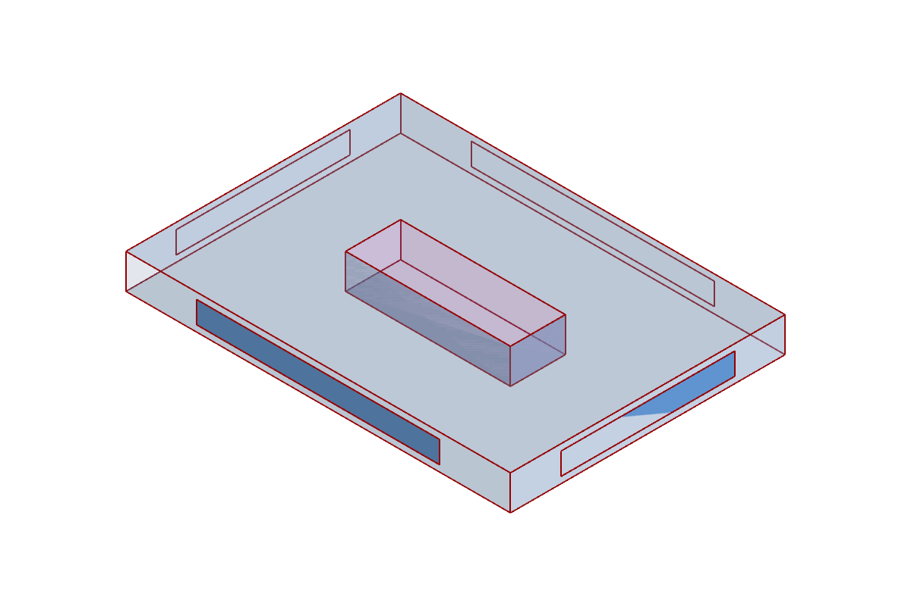{ width="49%" }
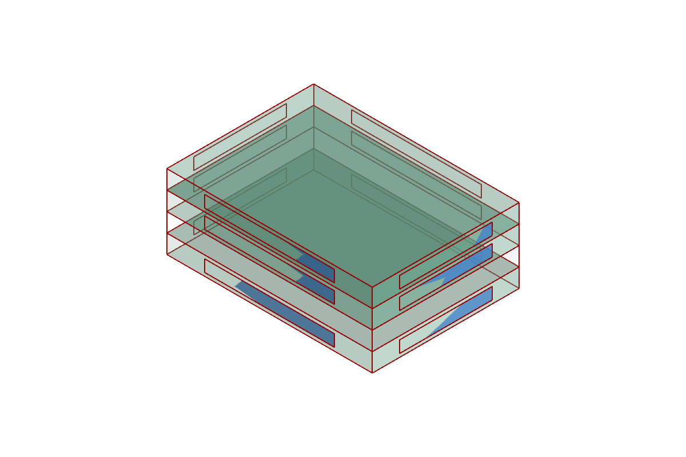{ width="49%" }

Example: `office-plate.gh` ([canvas](../assets/screenshots/canvas/office-plate.png)); reference: [Office Plate](components/generate.md#office-plate).

### Cafeteria

The kitchen and servery `KS`, one zone, along the whole north edge of a larger dining field `DI`; the servery counter is their shared edge. Inputs: *Length* (L) 30, *Dining Depth* (DD) 15, *Kitchen Depth* (KD) 8 (smaller than *Dining Depth*), *Floor Height* (FH) 4, *Orientation* (O) 0.

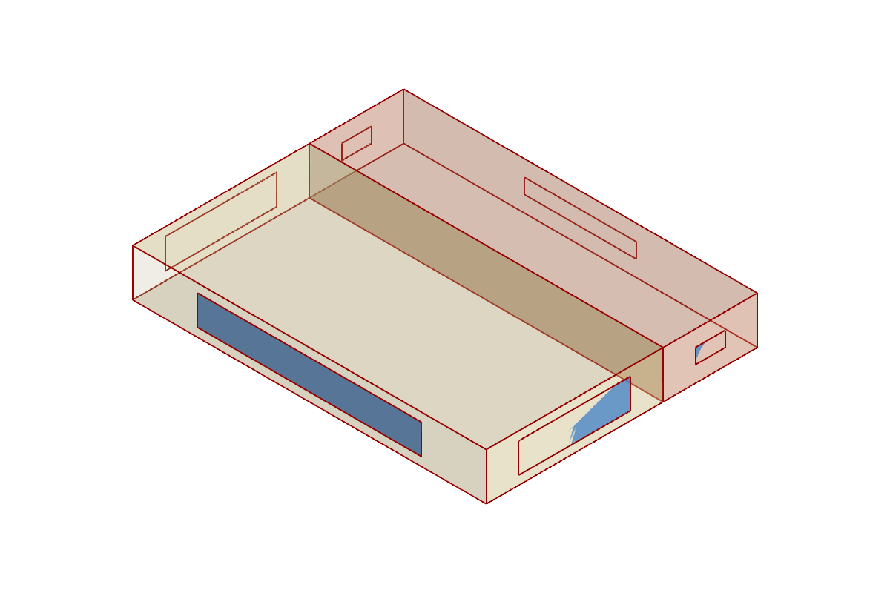{ width="49%" }
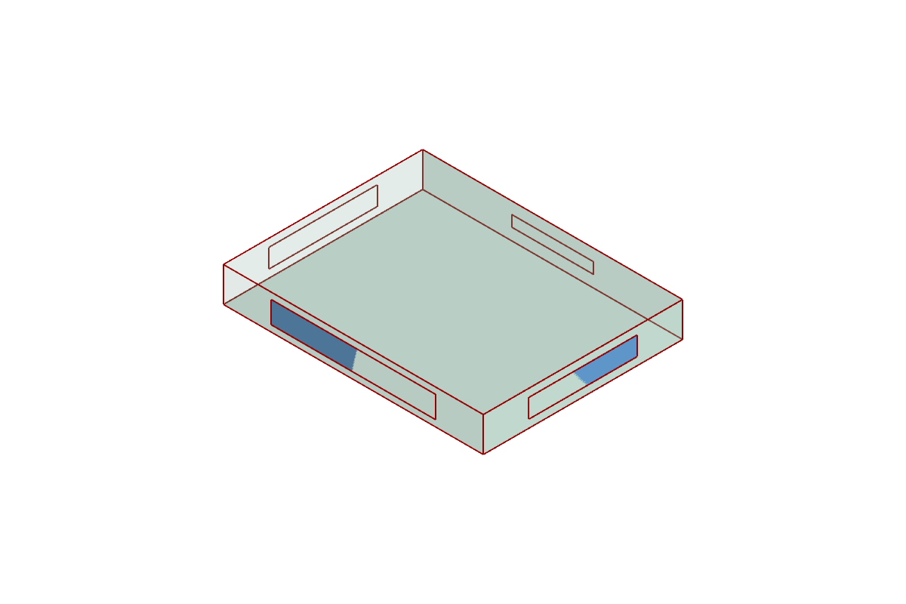{ width="49%" }

Example: `cafeteria.gh` ([canvas](../assets/screenshots/canvas/cafeteria.png)); reference: [Cafeteria](components/generate.md#cafeteria).

### Branching Mall

One mall zone `MALL` through a central court and three or four branches (east, north, west, then south), each with a shop wing on either side of the mall (`B{i}-S1`, `B{i}-S2`) and an anchor store `B{i}-AN` across its end. Inputs: *Branch Count* (BC) 3 (3 or 4), *Branch Length* (BL) 40, *Mall Width* (MW) 8, *Shop Depth* (SD) 12, *Anchor Depth* (AD) 30, *Floor Height* (FH) 5, *Orientation* (O) 0.

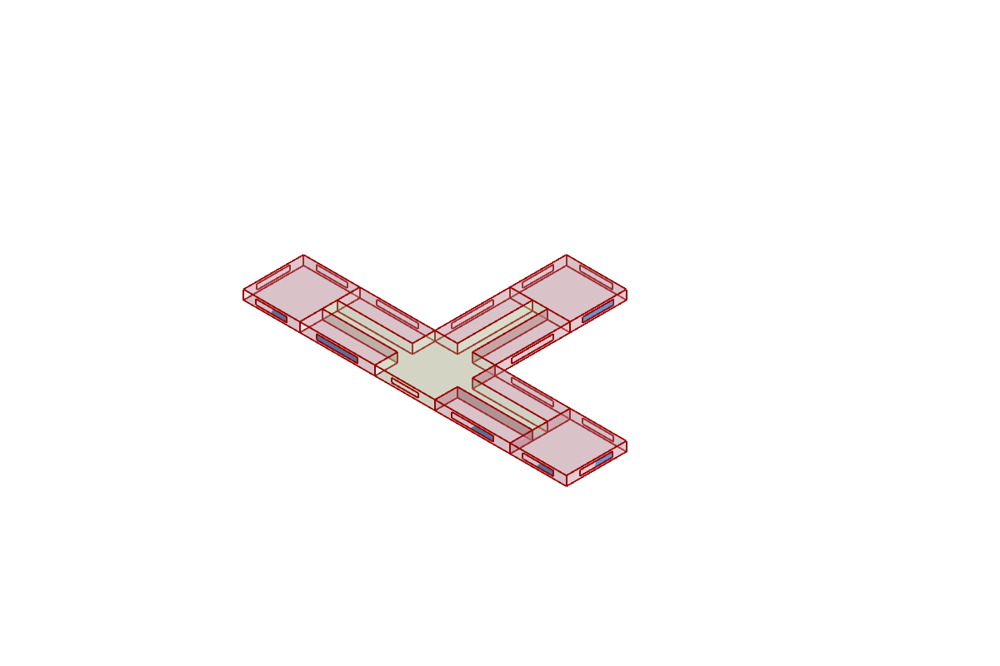{ width="49%" }
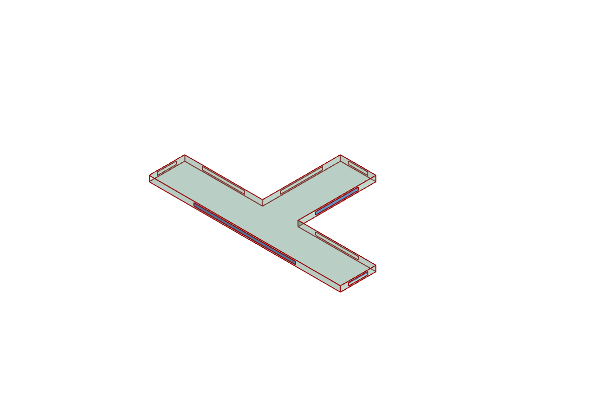{ width="49%" }

Example: `branching-mall.gh` ([canvas](../assets/screenshots/canvas/branching-mall.png)); reference: [Branching Mall](components/generate.md#branching-mall).

### Care Hub

Two to four bedroom wings around a communal hub `HUB`, each wing a corridor `W{i}-CO` from the hub to the wing's end between two bedroom zones `W{i}-B1`, `W{i}-B2`. The wing width, 2 × *Bedroom Depth* + *Corridor Width*, must not exceed *Hub Width*. Inputs: *Wing Count* (WC) 3 (2 to 4), *Wing Length* (WL) 30, *Bedroom Depth* (BD) 6, *Corridor Width* (CoW) 2.4, *Hub Width* (HW) 16, *Floor Height* (FH) 3, *Orientation* (O) 0.

{ width="49%" }
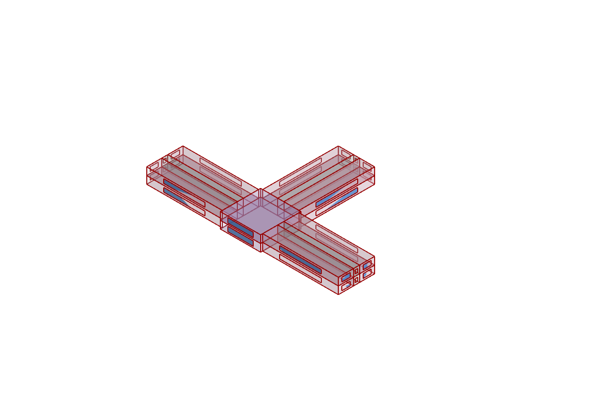{ width="49%" }

Example: `care-hub.gh` ([canvas](../assets/screenshots/canvas/care-hub.png)); reference: [Care Hub](components/generate.md#care-hub).

### Foyer Halls

Two or three activity halls and a support wing around a square public foyer `FO`: hall 1 east, the support wing `SV` north, hall 2 west, hall 3 south. Inputs: *Hall Count* (HC) 2 (2 or 3), *Hall Length* (HL) 30, *Hall Width* (HW) 20 (at most *Foyer Width*), *Support Length* (SL) 10, *Foyer Width* (FW) 20, *Floor Height* (FH) 6, *Orientation* (O) 0.

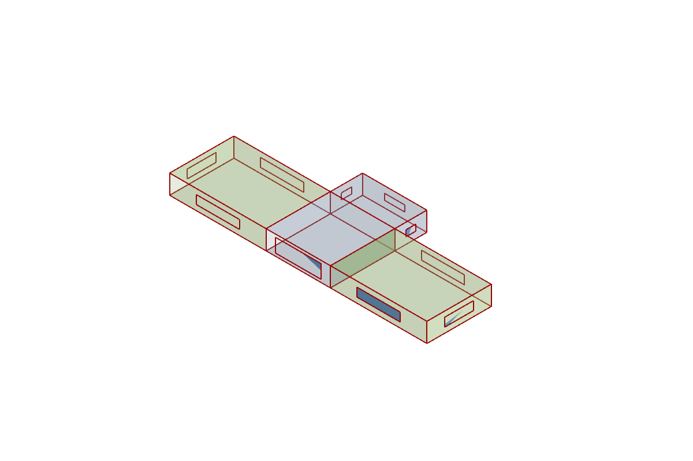{ width="49%" }
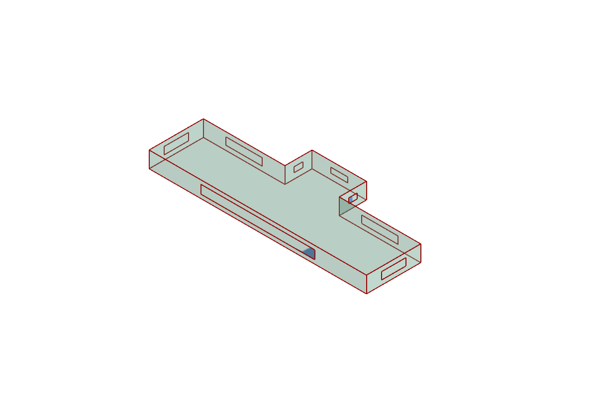{ width="49%" }

Example: `foyer-halls.gh` ([canvas](../assets/screenshots/canvas/foyer-halls.png)); reference: [Foyer Halls](components/generate.md#foyer-halls).

### Operating Suite

Support rooms `SUP` across the west end, then bands from south to north: a dirty corridor, and per bank a bank of theatres and the next corridor, the corridors alternating dirty and clean (`DC1`, `TB1`, `CC1`, `TB2`, `DC2`, …). Every bank lies between one clean and one dirty corridor. With the default theatre preset (WWR 0) the banks have no windows. Inputs: *Bank Count* (BC) 2 (at least 2), *Bank Length* (BL) 36, *Theatre Depth* (TD) 7, *Clean Corridor Width* (CW) 3, *Dirty Corridor Width* (DW) 2.4, *Support Length* (SL) 12, *Floor Height* (FH) 4.2, *Orientation* (O) 0.

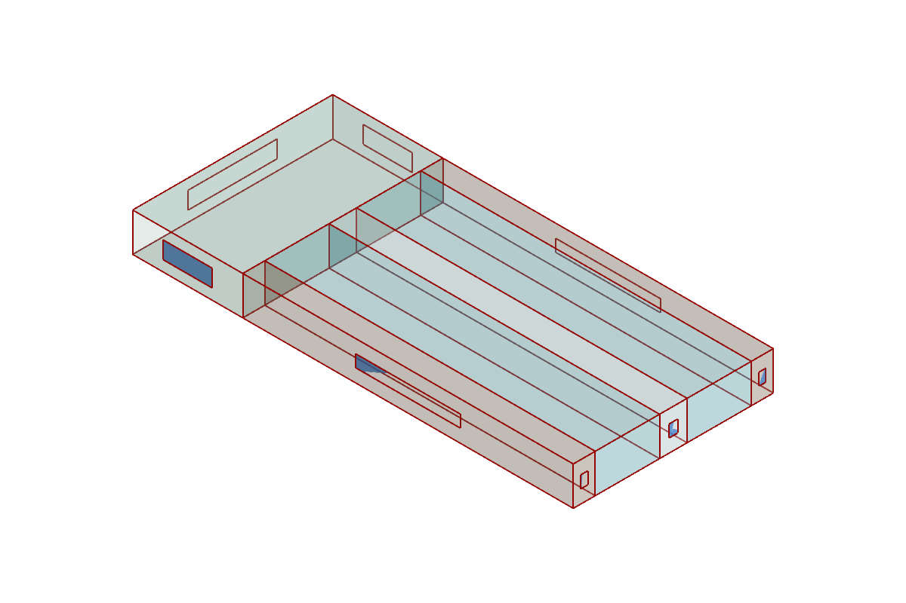{ width="49%" }
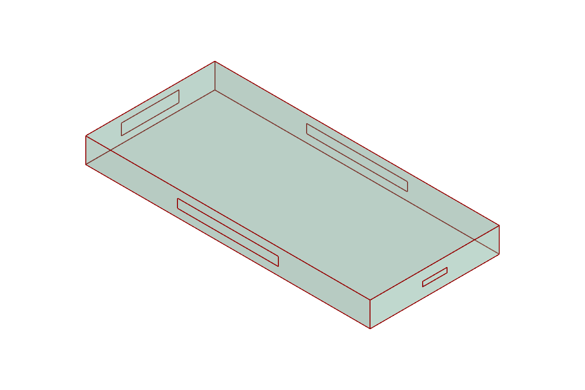{ width="49%" }

Example: `operating-suite.gh` ([canvas](../assets/screenshots/canvas/operating-suite.png)); reference: [Operating Suite](components/generate.md#operating-suite).

## Example definitions

The examples zip of each [release](https://github.com/energy-atlas/BEMGen-docs/releases), `bemgen-<version>-examples.zip`, holds one Grasshopper definition per typology and `end-to-end.gh`. Each reads left to right: the default preset components, the generator with its default inputs, a plan simplifier, a floor aggregator with a panel of storey multipliers, *Validate*, and *Convert2BEM* and *Convert2IDF* with *Write* off, in coloured groups with short notes. The simplifiers and aggregators vary across the examples so that each appears several times; any simplifier works with any aggregator. Open one in Grasshopper with the plugin installed; each solves without warnings or errors and validates.

| Definition | Simplifier | Aggregator | Multipliers |
| --- | --- | --- | --- |
| `linear-plan.gh` | No Simplification | Stack Floors | 3 |
| `stair-bay-bar.gh` | Semantic Merge | Stacked Floor Zone Multiplier | 3 |
| `stair-pair.gh` | Perimeter Core | Single Zone per Floor Type | 2 |
| `gallery-bar.gh` | Single Zone per Floor | Single Zone Building | 3 |
| `terrace-row.gh` | Semantic Merge | Stack Floors | 2 |
| `point-plate.gh` | Perimeter Core | Stacked Floor Zone Multiplier | 4 |
| `winged-band.gh` | Single Zone per Floor | Single Zone per Floor Type | 3 |
| `open-court.gh` | No Simplification | Single Zone Building | 3 |
| `enclosed-court.gh` | Perimeter Core | Stack Floors | 3 |
| `office-plate.gh` | Single Zone per Floor | Stacked Floor Zone Multiplier | 4 |
| `cafeteria.gh` | No Simplification | Single Zone per Floor Type | 1 |
| `radial-lobes.gh` | Semantic Merge | Single Zone Building | 2 |
| `branching-mall.gh` | Single Zone per Floor | Stack Floors | 1 |
| `care-hub.gh` | No Simplification | Stacked Floor Zone Multiplier | 2 |
| `foyer-halls.gh` | Semantic Merge | Single Zone per Floor Type | 1 |
| `operating-suite.gh` | Perimeter Core | Single Zone Building | 1 |
| `court-cluster.gh` | Semantic Merge | Stacked Floor Zone Multiplier | 3 |
| `stepped-band.gh` | Perimeter Core | Stack Floors | none: one plan per storey, one floor each |
| `end-to-end.gh` | Perimeter Core (Depth 4.57) | Stack Floors | 1, 3, 1 ([end-to-end example](example-end-to-end.md)) |

All values are the components' defaults. The zip's `README.md` describes the definitions.
