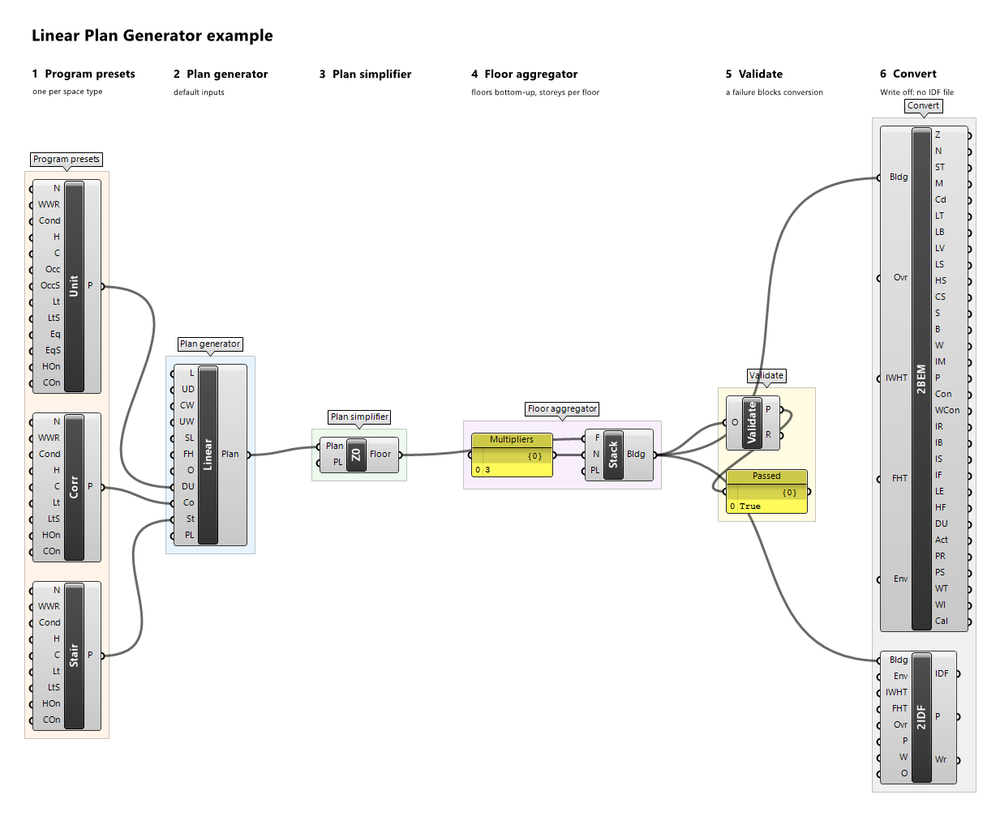

# Workflow

A BEMGen definition always follows the same chain:

1. [Program presets](#1-program-presets) for every space type the plan needs, and optionally an [envelope preset](#envelope-preset).
2. A [plan generator](#2-generate-a-plan) builds the detailed plan; [Transform Plan](#move-and-rotate-a-plan-transform-plan) optionally moves it.
3. A [plan simplifier](#3-simplify-the-plan) turns the plan into a floor at the zoning level you want.
4. A [floor aggregator](#4-stack-the-floors) stacks the floors, with [multipliers](#multipliers), into a building.
5. [Validation](#5-validate) checks the floor or building.
6. [Convert2BEM](#6-convert2bem) and [Convert2IDF](#7-convert2idf) turn the building into ClimateStudio inputs or an EnergyPlus file.

Each component does one step and passes one object to the next. Inputs, outputs, and defaults of every component are listed in the [component reference](components/index.md); this page explains how to use them together. For a complete definition with numbers, see the [end-to-end example](example-end-to-end.md).



*The example definition `linear-plan.gh`, left to right: presets, generator, simplifier, floor aggregator with its multipliers panel, Validate, and both converters.*

## 1. Program presets

Every plan generator has one required preset input per space type it places, for example *Dwelling Unit*, *Corridor*, and *Stair* on the *Linear Plan Generator*. An unconnected preset input gives Grasshopper's usual warning (`Input parameter DU failed to collect data`) and no plan; there is no fallback preset.

### Built-in presets

Panel *1 Program Presets* has one component per space type: *Dwelling Unit Preset*, *Corridor Preset*, *Stair Preset*, *Office Preset*, *Core Preset*, *Retail Preset*, *Mall Preset*, *Kitchen Preset*, *Dining Preset*, *Operating Theatre Preset*, *Clean Corridor Preset*, *Dirty Corridor Preset*, *Clinical Support Preset*, *Care Bedroom Preset*, *Care Communal Preset*, *Lobby Preset*, *Activity Hall Preset*, and *Service Preset*. Each outputs a *Preset* of its space type, and every input defaults to the illustrative example values, so it works with nothing connected (each shows a remark saying the values are illustrative).

Inputs, in order:

| Input | Nickname | Meaning |
| --- | --- | --- |
| Name | N | Preset name; descriptive only (reports, provenance, messages), never used for matching. |
| WWR | WWR | Window-to-wall ratio in [0, 1) used by the plan generator for every outdoor wall of this space type. |
| Conditioned | Cond | Whether the space is heated and cooled; the setpoints are ignored when it is not. |
| Heating | H | Constant heating setpoint, °C. |
| Cooling | C | Constant cooling setpoint, °C. |
| one number per load | e.g. Occ, Lt, Eq, Inf | The design value of each load of the preset, in its unit (people/m², W/m², 1/h, …, stated in the input's description). |
| one schedule per load | e.g. OccS, LtS | Optional fraction schedule that replaces the load's built-in schedule when connected. |

The loads depend on the space type. For example *Dwelling Unit Preset* has *Occupancy* (0.03 people/m²), *Lighting* (5 W/m²), *Equipment* (5 W/m²), and *Infiltration* (0.3 air changes per hour), WWR 0.3, conditioned at 21 °C / 24 °C; *Corridor Preset* has *Lighting* and *Infiltration*, WWR 0.2, conditioned; *Stair Preset* has *Lighting* (3 W/m²) and *Infiltration*, WWR 0.1, and is unconditioned. The values of all eighteen presets and their schedules are listed in [program presets](../developer/research/program-presets.md).

### General presets

Panel *1 Program* builds a preset for any space type from scratch:

- *Schedule* (Sch): an 8760-hour schedule from a *Name*, a *Kind* (`Fraction` for loads, `Temperature` for setpoints), 24 hourly *Weekday* values (Monday to Friday), 24 hourly *Weekend* values (Saturday and Sunday), and the *First Day* of the year (default `Monday`). Holidays are not modelled.
- *Load* (Load): a load from its *Type* (`Occupancy`, `Lighting`, `ElectricEquipment`, `GasEquipment`, `DomesticHotWater`, `Ventilation`, `Infiltration`), *Basis* (`PerFloorArea`, `PerPerson`, `Absolute`, `PerExteriorWallArea`, `AirChangesPerHour`), *Value* in the basis' unit, and a fraction *Schedule*.
- *Program Preset* (Preset): a preset from a *Name*, a *Space Type* (one of the space type names), a list of *Loads* (at most one per type and basis), *Conditioned* (default true), *Heating* and *Cooling* temperature schedules (required when conditioned), and a *WWR*.
- **Choosing a value.** *Kind* and *First Day* of *Schedule*, *Type* and *Basis* of *Load*, and *Space Type* of *Program Preset* take the name of a value as text, typed in any case. You can type it or wire a panel. You can also right-click the input and pick the value from the menu, where the current one is ticked. Or choose *Extract parameter* on the input: this places a dropdown (a *Value List*) with every value, wired into the input and set to its current value.

Text inputs are matched case-insensitively; an unknown name gives an error that lists the valid names.

### Any-program preset

A preset of one space type cannot be wired into an input of another: an *Office Preset* on the *Linear Plan Generator*'s *Corridor* input is the error `PresetSpaceTypeMismatch`. To use a program on a different space type, wire the preset through the parameter *Any Program Preset* (AnyP) in panel *1 Program*. It casts any preset, built-in or general, to a preset without a space type, with the same name, loads, schedules, conditioning, setpoints, and WWR. Every preset input of every generator accepts it: the zones keep the input's space type (the corridor stays a `Corridor` zone) and take the preset's program and WWR, and the plan's provenance records `AnyProgramPreset.Corridor=Example Office`, so the change of program is never silent.

### Envelope preset

*Envelope Preset* (Env), in panel *1 Program Presets*, gives the constructions to both converters. Its layered constructions are those of the illustrative *Example Envelope*; its inputs set the preset *Name* (default `Example Envelope`) and the window's simple glazing: *Glazing* name (`Example Double Glazing`), *U-Factor* (1.8 W/(m²·K), at most 7), *SHGC* (0.4), and *VT* (0.7). If a converter's *Envelope* input is left unconnected, the converter uses the *Example Envelope*; if it is connected but receives no envelope preset, the converter warns and uses the example too. The constructions are described in [envelope presets](../developer/research/envelope-presets.md).

## 2. Generate a plan

Panel *2 Generate* holds the eighteen plan generators, one per typology family ([Typologies](typologies.md)). Each has number inputs with defaults, then its preset inputs, then *Preview Location*, and one *Plan* output.

- **Dimensions** are in metres regardless of the model units. Every family has *Floor Height* (floor-to-floor height) and *Orientation* (clockwise rotation of plan north from true north, degrees; 0 means plan north is true north). Counts (*Bay Count*, *Wing Count*, …) are whole numbers with a family minimum.
- **Plan frame.** Plans are laid out axis-aligned with the south-west corner of the bounding box at the origin and the long side along x. *Orientation* changes only which way is north, not the geometry; use *Transform Plan* to move or rotate the geometry itself.
- **Errors.** A value that would break the family (a count below its minimum, a non-positive length, a core that leaves no room) is the error `InvalidParameter`, with a message naming the input. A wrong preset is `PresetSpaceTypeMismatch`.
- **Windows.** One centred window per outdoor wall, sized from the zone preset's WWR. A wall shorter than 1 m, or a window that would be narrower or lower than 0.3 m, gets no window and a remark `WindowOmitted`; the plan is still produced.

### Preview Location

Every component with a viewport preview (the generators, *Transform Plan*, the simplifiers, and the floor aggregators) has an optional last input *Preview Location* (PL), a vector in model units, default zero. It moves only that component's preview; the data and every output keep their true coordinates. Use it to lay several stages side by side in the viewport, for example the plan at the origin, the simplified floor 40 m to the east, and the building 80 m to the east.

### Move and rotate a plan: Transform Plan

*Transform Plan* (TPlan), in *2 Generate*, takes a *Plan* and a Grasshopper *Transform* and outputs the moved plan. It applies only the rotation about the world z axis and the translation in x and y (the transform is in model units; BEMGen converts it to metres). Any other part of the transform (a z translation, a rotation about another axis, scaling, shear, mirroring, projection) is not applied and gives a warning that states what was applied. Storey heights come from the floor aggregator, never from the transform. Combine a *Rotate* and a *Move* transform with Grasshopper's *Compound* component, or use *Orient*. Plans stay valid at any rotation: every simplifier and aggregator works on rotated and moved plans.

### Storey plans

*Stepped Band* is the one generator whose plan differs by storey: each storey steps back from the one below, leaving a terrace. Its *Plan* output is a list of plans, bottom to top (three by default). Wire the list into a simplifier (Grasshopper then simplifies each storey) and the simplifier's *Floor* output into a floor aggregator's *Floors*, **with *Multipliers* unconnected**, so each floor stands for one storey. The viewport draws each storey at its height, also after *Transform Plan* and simplification; the plans themselves all lie at elevation 0 until the aggregator stacks them. The terraces become outdoor roof pieces of the storey below.

## 3. Simplify the plan

Panel *3 Simplify* has four plan simplifiers. Each takes a *Plan* and outputs a *Floor*.

| Component | Level | Result |
| --- | --- | --- |
| *No Simplification* (Z0) | Z0 | The plan's own zones and surfaces, unchanged. |
| *Semantic Merge* (Z1) | Z1 | Connected zones of the same space type merged into one zone each (for example all dwelling units of a wing). |
| *Perimeter Core* (Z2) | Z2 | One perimeter zone per orientation, *Depth* deep (default 4.57 m), plus a core; corners split on the bisectors. Courts get their own perimeter zones. |
| *Single Zone per Floor* (Z3) | Z3 | The whole floor as one zone. |

Merged zones get the area-weighted programs of their sources: installed loads and the scheduled load at every hour are conserved, air changes are volume weighted, and the setpoints are floor-area weighted over the conditioned sources. A merged zone is conditioned if any source is, so merging the unconditioned stair into a conditioned zone enlarges the conditioned floor area; validation reports this as a note. Every rebuilt outdoor wall gets one centred window with the glazed area of the windows it covers.

*Perimeter Core* needs every wing of the footprint to be wider than twice the *Depth*; otherwise it fails with `PlanTooNarrow`. Reduce *Depth* or use another simplifier.

*Map Source to Target* (Map), in *6 Inspect*, lists for a floor which source zone overlaps which target zone, the overlap area, and the fraction of each.

## 4. Stack the floors

Panel *4 Aggregate* has four floor aggregators. Each takes *Floors*, a list ordered **bottom to top**, and optional *Multipliers*, and outputs a *Building*. They share the same first step: the full stack is assembled (each floor repeated by its multiplier, storey *k* at the sum of the floor heights below it, zone IDs prefixed `L{k}/`), and every floor and ceiling is split into ground, roof, exposed, and between-storey pieces.

| Component | Zones | Multiplier N | Floors and ceilings between storeys |
| --- | --- | --- | --- |
| *Stack Floors* (Stack) | every storey explicit, zones `L0/…`, `L1/…`, … | the floor is repeated N times | between two zones |
| *Stacked Floor Zone Multiplier* (ZMult) | one representative storey per group of N storeys, at its true elevation; storeys with ground, roof, or exposed surfaces are split off as single storeys | zone multiplier N on the representative storey's zones | adiabatic |
| *Single Zone per Floor Type* (1ZType) | one zone `E{i}` per floor entry, spanning its N storeys | the floor is repeated N times before merging | between two entries: between zones; within an entry: internal mass |
| *Single Zone Building* (1ZBldg) | one zone `BUILDING` | the floor is repeated N times before merging | internal mass |

### Multipliers

*Multipliers* takes one whole number from 1 per floor, in the same order as *Floors*, or nothing, which means 1 for every floor. A list of another length is the error `Give one multiplier per floor (n), or none for all 1.` To build a five-storey building from one floor with a distinct ground floor, middle, and top, give the same floor three times (Grasshopper's *Merge* component with the floor in three inputs) and the multipliers 1, 3, 1.

The floors of one building may come from different plans and simplifiers, but they must have the same *Orientation* (`OrientationMismatch`). A storey not fully supported by the storey below gets the warning `UnsupportedStorey` with the uncovered area; the building is still produced. *Stacked Floor Zone Multiplier* reports the storeys it split off with the remark `FloorTypeSplit`, and draws the represented but unmodelled storeys in transparent grey.

## 5. Validate

*Validate* (panel *6 Inspect*) takes a floor or a building and outputs *Passed* (true when every enforced check passes) and a *Report*, one line per check: `ok` (passed), `FAIL` (an enforced check failed), or `note` (a reported-only check differs), with the reference and actual values.

- A floor is compared with its source plan: floor area, volume, conditioned floor area (note only), exterior wall area, glazing in total and per orientation (North, East, South, West), installed and hourly scheduled magnitude of every load type, façade coverage, no overlapping zones, source coverage, and traceability.
- A building is compared with each of its source floors' plans (lines prefixed `Floor0.`, `Floor1.`, …) and with the same floors stacked with every storey explicit (lines prefixed `Building.`), which adds ground, roof, and exposed floor area and the building height.

A failed validation adds a warning to *Validate*. You do not need *Validate* before converting: both converters validate the building themselves.

*Inspect* (panel *6 Inspect*) gives a text *Report* (zones, loads, surfaces) and the *Provenance* of a plan, floor, or building.

## 6. Convert2BEM

*Convert2BEM* (2BEM), panel *5 Convert*, turns a building into Grasshopper data trees for a ClimateStudio definition. Its output layout is provisional until a ClimateStudio reference definition exists.

Inputs:

| Input | Nickname | Default | Meaning |
| --- | --- | --- | --- |
| Building | Bldg | — | The building from a floor aggregator. |
| Override | Ovr | false | Convert even if validation fails; recorded in *Provenance*. |
| EnableInternalWallHeatTransfer | IWHT | false | Write walls between two zones as `Interzone:<zone ID>`; when false they are written `Adiabatic`. |
| EnableFloorHeatTransfer | FHT | false | The same for floors and ceilings between two zones. |
| Envelope | Env | Example Envelope | Envelope preset (optional). |

The building is validated first. If it fails and *Override* is false, the component shows the error `ValidationFailed` and only *Provenance* is set, so you can read the failing checks. If *Override* is true it converts, warns `ValidationOverridden`, and ends *Provenance* with `OVERRIDE: converted despite failed validation`.

Outputs are trees with one branch `{i}` per zone, in building order:

| Output | Nickname | Branch `{i}` holds |
| --- | --- | --- |
| Zones | Z | closed Breps of the zone's parts (model units) |
| Names | N | the zone ID, e.g. `L0/P-North` |
| Space Types | ST | the space type |
| Multipliers | M | the zone multiplier |
| Conditioned | Cd | whether the zone is conditioned |
| Load Types, Load Bases, Load Values | LT, LB, LV | one item per load, aligned |
| Load Schedules | LS | branch `{i;k}`: 8760 fractions of load *k* |
| Heating Setpoints, Cooling Setpoints | HS, CS | 8760 values, °C; empty for an unconditioned zone |
| Surfaces | S | walls, floors, and ceilings, each facing out of the zone |
| Boundaries | B | per surface: `Outdoors`, `Ground`, `Adiabatic`, or `Interzone:<zone ID>` |
| Windows | W | the windows of the zone's walls |
| Internal Mass | IM | exposed internal-mass area, m² |
| Provenance | P | provenance, validation report, options, envelope, override |
| Constructions | Con | per surface, the construction name from the envelope preset |
| Window Constructions | WCon | per window, the glazing name |

A zone without windows (an interior core) or without loads has no branch in *Windows* or the load outputs: match branches by path, not by position.

### Heat transfer between zones

The two heat-transfer options decide how surfaces between two zones are written; they change neither the building nor its validation. Off (the default), walls and slabs between zones are adiabatic, so each zone exchanges heat only with the outdoors and the ground. On, they are written as paired interzone surfaces. The same options exist on *Convert2IDF*. *Stacked Floor Zone Multiplier* buildings have no slab between storeys to pair: those pieces are adiabatic in the building itself.

## 7. Convert2IDF

*Convert2IDF* (2IDF), panel *5 Convert*, writes an EnergyPlus 25.2 input file: constructions from the envelope preset, ideal-loads HVAC for every conditioned zone, exact hourly schedules, loads, internal mass, and zone multipliers. It does not run EnergyPlus; the file holds only the minimum simulation objects, so add a weather file and the outputs you need before simulating.

| Input | Nickname | Default | Meaning |
| --- | --- | --- | --- |
| Building | Bldg | — | The building. |
| Envelope | Env | Example Envelope | Envelope preset (optional). |
| EnableInternalWallHeatTransfer | IWHT | false | Pair walls between zones; otherwise adiabatic. |
| EnableFloorHeatTransfer | FHT | false | Pair floors and ceilings between zones; otherwise adiabatic. |
| Override | Ovr | false | Convert even if validation fails; recorded in *Provenance* and the IDF header. |
| Path | P | — | Fully qualified path of the file to write (for example `C:\models\linear.idf`), in an existing folder; only used when *Write* is true. |
| Write | W | false | Write the file to *Path*; when false nothing is written. |
| Overwrite | O | false | Replace an existing file; when false an existing file is kept and the error `FileExists` is shown. |

Outputs: *IDF* (the file text; empty when validation blocks the conversion), *Provenance* (provenance, validation report, options, envelope, `ENERGYPLUS: 25.2`, any override, and `FILE: written <path>` or `FILE: not written (<reason>)`), and *Written* (whether the file was written in this solution).

!!! warning "Keep Write off while editing"
    Every solution with *Write* and *Overwrite* both true rewrites the file. Keep *Write* false while you build the definition and read the *IDF* text or wire it into a panel; set *Write* true when you want the file, for example with a *Button* or a *Boolean Toggle*.

Surface types follow the building: ceilings facing outdoors are written as `Roof`, others as `Ceiling`; vertices are the building's own coordinates in metres, and the building's *Orientation* becomes the IDF *North Axis*. Interzone pairs between zones with different multipliers are written adiabatic with the warning `InterzoneMultiplierMismatch`.

### Checking the file against the EnergyPlus IDD

BEMGen's repository, private for now, has a checker that compares IDF files with the EnergyPlus data dictionary (`Energy+.idd`, shipped with EnergyPlus). With Python 3, in a clone of that repository:

```bash
python scripts/idd-check/idd_check.py "C:\EnergyPlusV25-2-0\Energy+.idd" C:\models\linear.idf
```

It also takes a folder of IDF files. What it checks and its last run: [IDD check](../developer/architecture/convert2idf.md#idd-check).

## Runtime messages

BEMGen reports through Grasshopper's runtime messages: errors (red, no output), warnings (orange, output produced), and remarks (grey, information). A message from BEMGen's services starts with its severity and code, and the subject in brackets when there is one, for example `Warning UnsupportedStorey [L1]: …` or `Error ValidationFailed: …`. The codes (`InvalidParameter`, `PresetSpaceTypeMismatch`, `WindowOmitted`, `PlanTooNarrow`, `FileExists`, …) are listed in the [domain model](../developer/architecture/domain-model.md).
